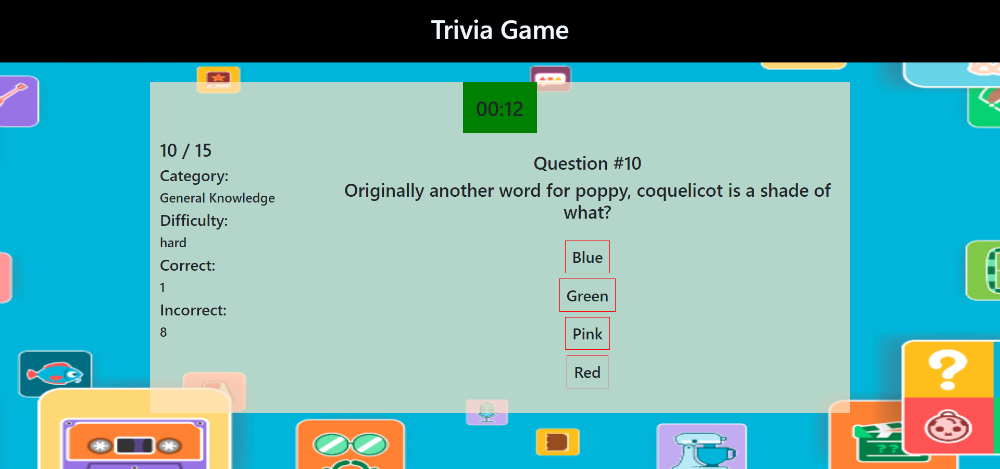

# TriviaGame

## Overview
***Full-stack application*** designed for Trivia game, for players to guess the correct answer that has been chosen from an API.

## Getting Started
These instructions will get you a copy of the project on your local machine.

### Installing
Git clone the repository to your local machine:

HTTPS:
```
https://github.com/AmjedAyoub/TriviaGame.git
```
SSH:
```
git@github.com:AmjedAyoub/TriviaGame.git
```

## ScreenShots


## Technologies & Tools
* HTML 
* CSS
* JavaScript
* Bootstrap

## Links
This application is deployed on GitHub Pages, [Try it yourself](https://amjedayoub.github.io/TriviaGame).\
This application is published on [GitHub](https://github.com/AmjedAyoub/TriviaGame).

## Authors
See contribution history [here](https://github.com/AmjedAyoub/TriviaGame/graphs/contributors).

## Future updates
At the moment, this app is the minimum viable product. For future updates; improve the UI/UX, and add more functionality and features such as enhancing the mobile responsivity. 